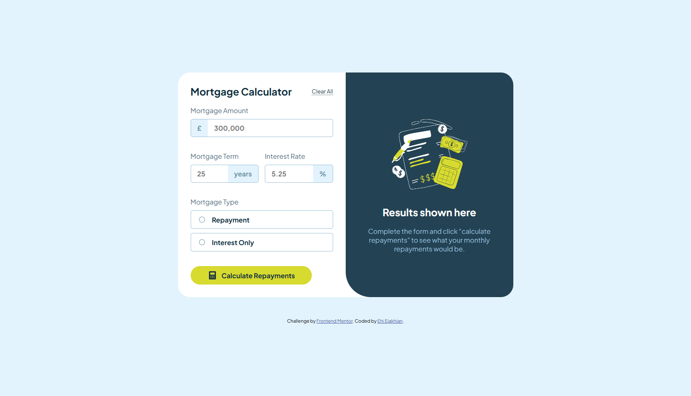

# Frontend Mentor - Mortgage repayment calculator solution

This is a solution to the [Mortgage repayment calculator challenge on Frontend Mentor](https://www.frontendmentor.io/challenges/mortgage-repayment-calculator-Galx1LXK73)

## Table of contents
- [Me](#meet-me)
- [Screenshot](#screenshot)
- [My process](#my-process)
  - [Built with](#built-with)
  - [What I learned](#what-i-learned)
  - [Continued development](#continued-development)
- [Author](#author)
- [Thanks](#thanks)


## Meet Me
Good day. I'm Ehi. I'm an aspiring developer from Edo, Nigeria. I took this challenge. Here's how I did it and thanks for reading!

## Screenshot

The Challenge

My Desktop design

## My process
After my HTML, I start styling with padding. I set the margin of all elements to zero and then give all elements borders. This helps me visualize all element boundaries - all this I do without adding any color.

Then, I add color, backgrounds and border radii to the assigned elements. I prefer using Comic Sans MS or Comic Relief as my font during design because it feels relaxing to my eyes and it helps me think better. I can't explain it though, it's just a feeling.

Funny and weird, right?😁

### Built with

- Semantic HTML5 markup
- CSS custom properties
- Flexbox
- SASS
- JavaScript


### What I learned

A lot. One of them was how to use mixins as if they were Javascript functions. SASS is really an upgrade due to its nesting feautures. here's how I did both.

```scss
@mixin display-flex($justify-content, $align-items, $flex-flow, $gap) {
  display: flex;
  align-items: $align-items;
  justify-content: $justify-content;
  flex-flow: $flex-flow;
  gap: $gap;
}

@mixin input-and-label-styling {
  @include display-flex(space-between, none, column, 10px);
  border: 1px solid;
}
```

I learnt how to use if statements better to log out text better on my error messages. It was beautiful.
```js
// Check mortgage amount
if (!mortgageAmount.value) {
  mortgageAmountisValid = false;
  amountError.textContent = "Please enter a valid mortgage amount."
  mortgageAmountParent.classList.add('error-border');
}else {
  amountError.textContent = ""
  mortgageAmountParent.classList.remove('error-border');

}

// Check mortgage term
if (!mortgageTerm.value) {
  mortgageTermisValid = false;
  termError.textContent = "This field is required."
  mortgageTermParent.classList.add('error-border');
}else {
  termError.textContent = ""
  mortgageTermParent.classList.remove('error-border');
}

// Check interest rate
if (!interestRate.value) {
  interestRateisValid = false;
  rateError.textContent = "This field is required."
  interestRateParent.classList.add('error-border');

}else {
  rateError.textContent = ""
  interestRateParent.classList.remove('error-border');
}

// Check mortgage type
let mortgageType = document.querySelectorAll('input[name="mortgage-type"]');
let ismortgageTypeChecked = Array.from(mortgageType).some(radio => radio.checked);
if (!ismortgageTypeChecked) {
  mortgageTypeisValid = false;
  typeError.textContent = "Please select a mortgage type."
}else {
  typeError.textContent = ""
}


if (mortgageAmountisValid && mortgageTermisValid && interestRateisValid && mortgageTypeisValid) {
  // Proceed with the calculation
  calculateRepayments();
  notEmptyDiv.style.display = 'flex';
  EmptyDiv.style.display = 'none';
} else {
  EmptyDiv.style.display = 'flex';
  notEmptyDiv.style.display = 'none';
}
```

```css
&:focus-within {
}
```
I also used this selector to style my radio inputs.

It was really fun!

### Continued development
I want to be faster next time. I did get everything done, but , I had to sleep over it.

## Author
For now I don't have a website of my own, but I am working on having one soon. It's very important.
- Frontend Mentor - [@EhiEjakhian](https://www.frontendmentor.io/profile/EhiEjakhian)
- Chat me on Whatsapp - [Ehi Ejakhian](https://wa.me/+2348142340182?text=Hello%20Ehi%20.%20I%20checked%20your%20mortgage%20calculator%20solution!)
- LinkedIn - [Ejakhian Ehi](https://ng.linkedin.com/in/ehi-ejakhian-2302a7318)

I'm also an aspiring comic and sketch artist, so if you have any gigs or if you can relate, check me up on whatsapp and see my art.

# Thanks!
Thank you for going through this. I really hope I did good to your taste, if not please tell me how to improve on the comments section of my solution. Thanks again!
